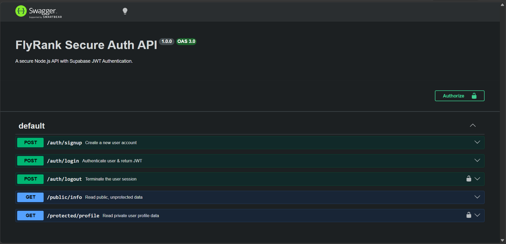

# 🔐 FlyRank Secure Auth API

A robust, production-ready backend API demonstrating secure user authentication, JSON Web Token (JWT) management, and protected route middleware. Built with Node.js, Express, and Supabase.



## 🚀 Features
* **Secure Authentication:** User signup and login powered by Supabase Auth as the Identity Provider (IdP).
* **JWT Verification:** Custom Express middleware to extract, validate, and authorize Bearer tokens.
* **Interactive Documentation:** Fully configured Swagger UI testing environment.
* **Environment Security:** Secrets management using `dotenv`.

## 🛠️ Getting Started

### 1. Clone the Repository
```bash
git clone [https://github.com/muhammadtaimoorajmal/flyrank-auth-api.git](https://github.com/muhammadtaimoorajmal/flyrank-auth-api.git)
cd flyrank-auth-api